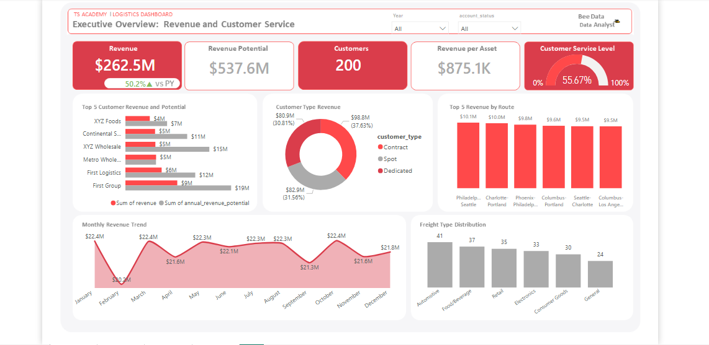
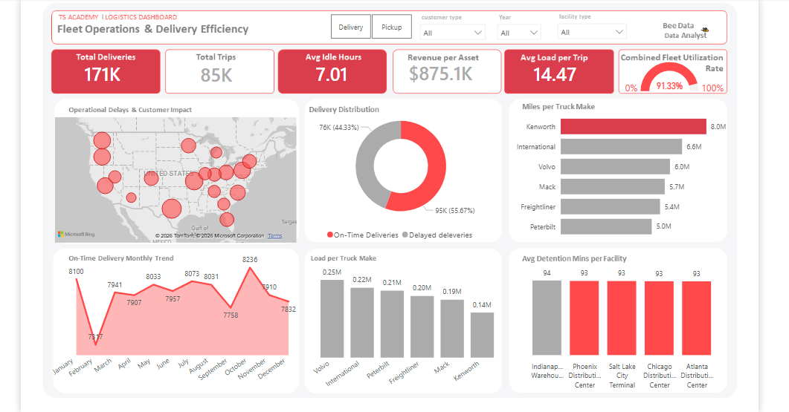
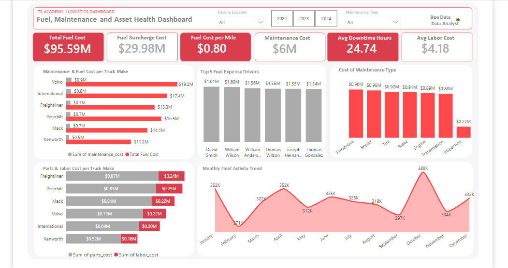
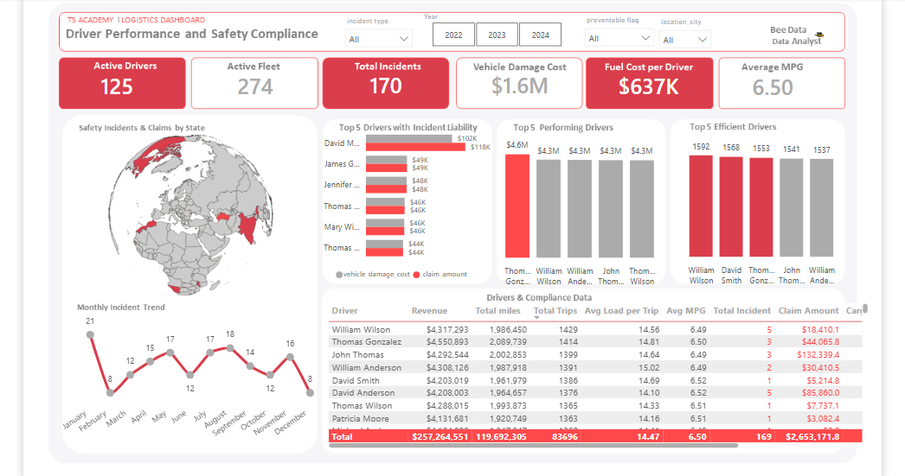

# Logistics Operation Analytics 🚚
## Introduction 🧾

*A comprehensive view of logistics operations and safety compliance.*

These dashboards were created as part of a capstone project to provide comprehensive overview of logistics operations in a company by monitoring financial performance, customer service and delivery efficiency, fleet operations, fuel performance and asset maintanence, driver performance and safety compliance. It enables stakeholders track important operational metrics, identify performance gaps, cut down operational costs, optimize fleet assets and further make future data driven decisions. The dataset for this project was provided with data from the past three years.

### Dashboard File
You can find the file for the dashboard here: [`Capstone_Logistics_Project.pbix`](project/Capstone_Logistics_Project.pbix).

## Skills Showcased

This project exposed me to key Power BI features and some of the them i have mastered include:

-   **⚙️ Data Transformation (ETL) with Power Query:** Cleaned, shaped, and prepared the raw data for analysis by handling blanks/ null values, changing data types, creating and merging new columns.
-   **🖇 Data Modelling:** Created relationships amongst 14 tables.
-   **🧮 Implicit Measures:** Formulated measures to derive key insights and KPIs like `Total Customers`, `On-Time and Delayed Deliveries`, `Total Fuel Consumed`, `Total Revenue`, `Active Drivers`, `Total Incidents`, `Average MPG`, `Average Downtime`, `Total Fuel Cost`, `Combined Fleet Utilization`, `Average Load per Trip` and so on.
-   **📊 Core Charts:** Utilized **Column, Bar, Line,** and **Area Charts** to compare revenue.on-timr delivery, fleet activity and incident trends over time.
-   **🗺️ Geospatial Analysis:** Leveraged **Map Charts** to visualize the country's distribution of safety incidents & claim amounts and operarional delays & customer impact.
-   **🔢 KPI Indicators & Tables:** Used **Cards** to display key metrics and **Tables** to provide granular, sortable data.
-   **🎨 Dashboard Design:** Designed an intuitive and visually appealing layout, exploring both common and uncommon chart types to best communicate a compelling and accurate data story.
-   **🖱️ Interactive Reporting:**
    -   **Slicers:** To dynamically filter the report by Job Title.
    -   **Drill-Through:** To navigate from a high-level summary to a contextual, detailed view.
 
---

## Dashboard Overview

*This report is split into four distinct pages to provide both a high-level summary and a detailed analysis.*

### Page 1: Revenue and Customer Service

This is your mission control for the data job market. It showcases key KPIs like total job count, median salaries, and top job titles to give you a quick understanding of what's happening in the job market at a glance.

## Key Insights

### Page 2: Fleet Operations and Delievery Efficiency

This is the deep-dive page. From the main dashboard, you can drill through to this view to get specific details for a single job title, including salary ranges, work-from-home stats, top hiring platforms, and a global map of job locations.

## Key Insights

### Page 3: Driver Performance and Safety Compliance

  

This is the deep-dive page. From the main dashboard, you can drill through to this view to get specific details for a single job title, including salary ranges, work-from-home stats, top hiring platforms, and a global map of job locations.

## Key Insights

### Page 4: Fuel, Maintenance and Asset Health

 

This is the deep-dive page. From the main dashboard, you can drill through to this view to get specific details for a single job title, including salary ranges, work-from-home stats, top hiring platforms, and a global map of job locations.

## Key Insights

---

## Conclusion

This dashboard showcases how Power

